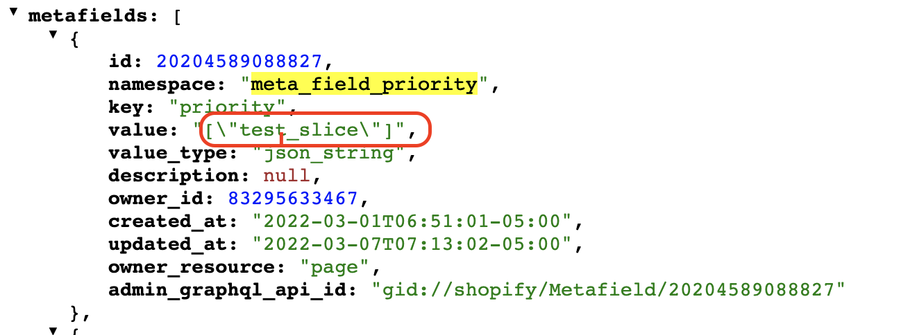
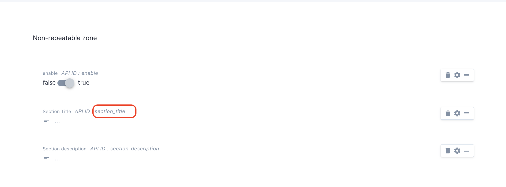
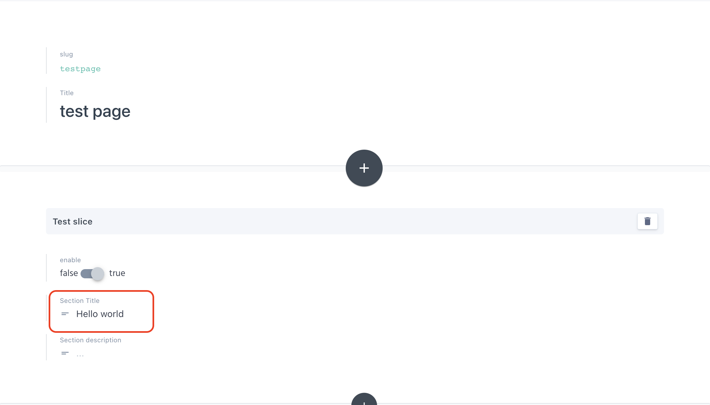

# Code Integration

Once we verified that pages are being created from prismic along with all of the data saved in its metafields.
We need to implement code to fetch those metafields data and render it.

 **How it works ?** 

- Once we publish page on prismic, Prismic adaptor will create the new page on shopify if it doesn't exist. In this page's metafields all of our slices are stored as a namespace and all of the data within that slice is saved as its key.
- If page already exist on shopify, it will only update the metafields.
- Prismic adaptor will add few metafields. One important field is  'meta_field_priority' , which keep track of all the slices used in that particular page in order.

**Code logic**
- loop through all the metafields created in a page.
- Search for  
``` namespace:  'meta_field_priority' ```  
```  key: 'priority' ```
- loop through its value , as it contains the slices names in the same order as we have implemented in prismic side.
- create the snippet with the slice_name,but using **slice-name** instead of **slice_name**
- loop through each slice_name , which is also the metafield namespace.
- pass the namespace a.k.a slice_name and render the snippet that matches the **slice-name** 
- check for keys in specific namespace on page metafields or  
- go to prismic custom type and get the **API_ID** of each placeholder of the specific slice.
- Once you get the key, Fetch the **namespace** that were sent earlier while rendering in a variable name 'Module';
- now you can following snippet to render the value, 
```
metafields[module].key
```

## Create a template

Create a new page template  and paste the code.

:::warning
You only need to create one common page template for all of the prismic pages.
:::

<<< @/src/source-files/metafields.liquid

<div class="block-space"></div>

----


## Create snippets

**Go to page url**

 

 <div class="block-space"></div>

----
 
- **Add "/metafields.json" at the end of url**

 

  <div class="block-space"></div>

  ----

- **Search for 'meta_field_priority'**

 

<div class="block-space"></div>


----

- **Check value of 'meta_field_priority'**

 

<div class="block-space"></div>

----

- **Create a snippet using 'meta_field_priority'**

  Check the value key of 'meta_field_priority'   
  ```"test_slice```  

  Make a new snippet with the title of each seperated value.

:::danger
Make sure you name the snippet as **test-slice** not  **test_slice** !!
:::

```
snippets/test-slice.liquid
```

:::tip
**test_slice** is also the metafields namespace. 
:::

<div class="block-space"></div>


----


## Get metafields namespace and key for the created snippets

The created snippets have access to the 'namespace' called module.

Fetch all the metafields belonging to that namespace using,


```
snippets/test-slice.liquid

<!-- fetch metafields based on namespace(slice_test) -->
 
```

:::tip
Each **slice name** on **prismic** works as a **metafield namespace** and a **snippet name**,  
And each **placeholder** in slice acts as a **metafields key**.
:::

Fetch the metafield key by going to the prismic dashboard / custom types / slice ,
Copy the placeholder id.  

**Placeholder id** acts as an metafields key, 




## Fetch Data

Use the namespace(slice_test) and key(section_title) acquired from above, to fetch the value of that placeholder.
```
snippets/test-slice.liquid

<!-- fetch value based on key(section_title) -->
 
```

## Full Code
```
snippets/test-slice.liquid

<!-- fetch metafields based on namespace(slice_test) -->
 

<!-- fetch value based on key(section_title) -->
 

<!-- Render data -->
<h1 class="section__title">{{section_title}}</h1>
```


## Verify changes

Now assign your prismic **page template** to **prismic-page**  
View your page in the prismic-page template 
```
/pages/{page handle}?view=prismic-page
```




