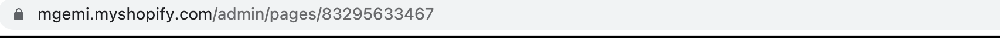
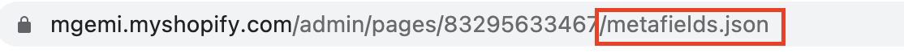
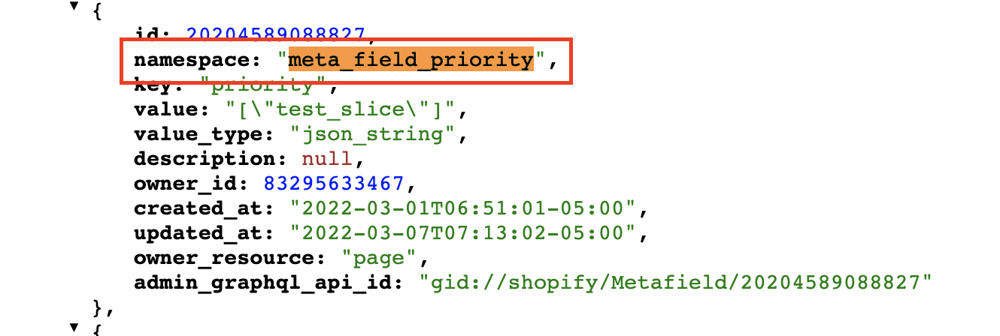

# Code Integration

Once we verified that pages are being created from prismic along with all of the data saved in its metafields.
We need to implement code to fetch those metafields data and render it.

 **How it works ?** 

- Once we publish page on prismic, Prismic adaptor will create the new page on shopify if it doesn't exist. In this page's metafields all of our slices are stored as a namespace and all of the data within that slice is saved as its key.
- If page already exist on shopify, it will only update the metafields.
- Prismic adaptor will add few metafields. One important field is  'meta_field_priority' , which keep track of all the slices used in that particular page in order.

## Fetch metafields

Fetch metafields from the page created from prismic.  
Paste this code inside the template file where you would want to render the prismic components.

<<< @/src/source-files/metafields.liquid

It'll look up for the snippet with the same name that is recieved on 'priority' key. More about snippets <a href="#create-snippets" class="green-link">here</a>
  
<div class="block-space"></div>

----


## Create snippets

**Go to page url**

 

 <div class="block-space"></div>

----
 
- **Add "/metafields.json" at the end of url**

 

  <div class="block-space"></div>

  ----

- **Search for 'meta_field_priority'**

 

<div class="block-space"></div>


----

- **Check value of 'meta_field_priority'**

 

<div class="block-space"></div>

----

- **Create a snippet using priority value**

Here each comma seperated value refers to a prismic slices or page sections.
make a new snippet on shopify with the same comma seperated value but with a minor change. 

Here each comma seperated value is on snake_case like **"test_slice"** , but we use kebab case like **"test-slice"** for snippet name.   
Hence, create a snippet with the kebab case,   
In our case, its "test-slice"

:::tip
Each comma seperated value a.k.a Slice, is also the namespace for each of the data(key) belonging to that slice.
:::

<div class="block-space"></div>


----


## Get metafields namespace and key for the created snippets

The created snippets have access to the 'namespace' called module.

Fetch all the metafields belonging to that namespace using,


``` 
 
```

:::tip
Each **slice name** on prismic works as a namespace and a snippet name,  
And each **placeholder** in slice acts as a metafields key.
:::

Fetch the metafield key by going to the prismic dashboard / custom types / slice ,
Copy the placeholder id.  

**Placeholder id** acts as an metafields key, 


## Fetch Data

Use the namespace and key acquired from above, to fetch the value of that placeholder.

``` 
 
```

## Verify changes

Now assign your page to the template where you <a href="#fetch-metafields">fetched the metafields.</a>
View your page.


