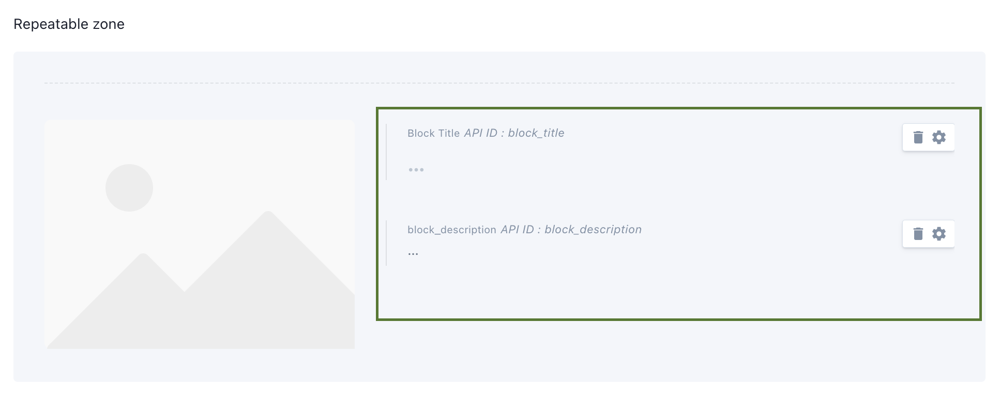
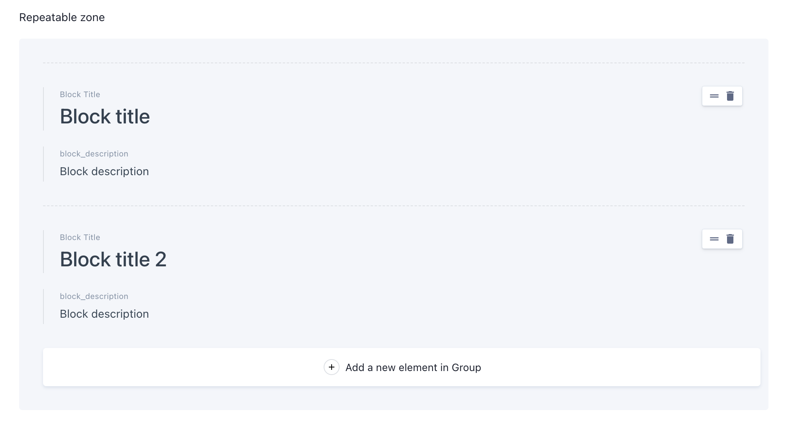
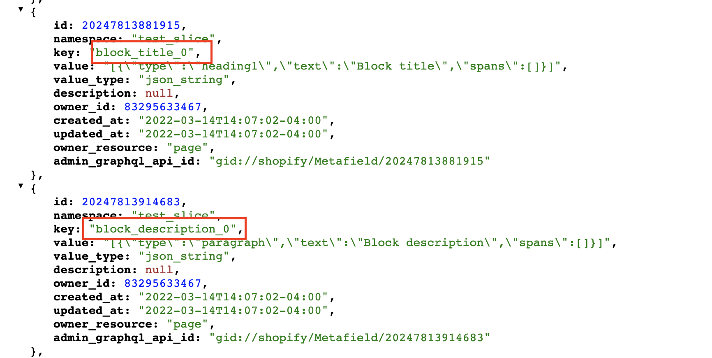
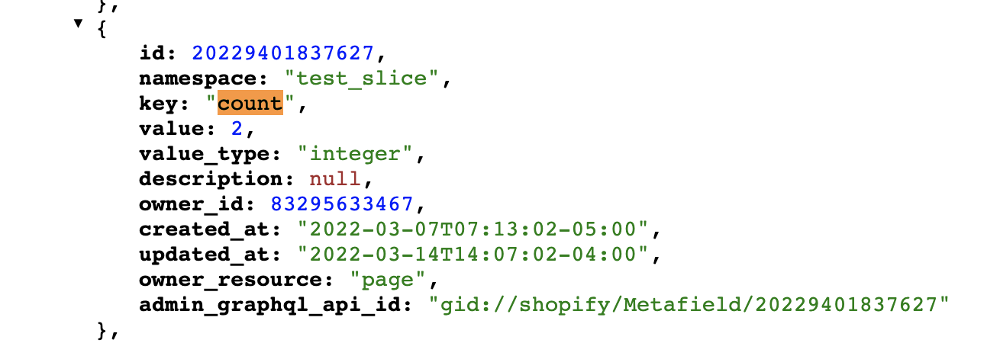

## Lets quickly revise our prismic setup for page.
<div class="block-space"></div>

```
Custom Types > Test
```

<div class="block-space"></div>

```
Documents > Test Page
```
<div class="block-space"></div>

<div class="block-space"></div>

```
Shopify > Test Page metafields
```
<div class="block-space"></div>

<div class="block-space"></div>

----


## NEXT STEPS

<div class="block-section"></div>

## Get total count of repeatable item in a namespace

 There is a metafield that keeps count of all the repeated zone items. USe that metafield key to fetch total count of repeatable items.
<div class="block-space"></div>
 
 <div class="block-space"></div>

 ```

```
<div class="block-space"></div>

----

## Loop within that count, and generate the metafields key
<div class="block-space"></div>

As each of the **metafields key** of **repeated item** ,have a **index added**.

We can **loop** within the **total number of repeated item** and then **add index** to **placeholder id**. 

Learn more about <a href="../code-integration.html#get-metafields-namespace-and-key-for-the-created-snippets" class="green-link">metafields key and placeholder id</a>
<div class="block-space"></div>

```
<div class="item__list">
    
    
    
       <div class="item__single">
         <h2 class="item__title">{{title}}</h2>
         <p class="item__text">{{description}}</p>
       </div>
    
</div>
```

:::warning
 Use **snake_case** for liquid variables.
:::

<div class="block-space"></div>

----


## Full Code
<div class="block-space"></div>

```
snippets/test-slice.liquid

<!-- fetch metafields based on namespace(slice_test) -->
 

<! -- fetch total number of repetable items based on namespace -->


<!-- Render data -->
<div class="item__list">
   <!--  Loop within the total count  -->
    
       <!-- Generate metafields key -->
         
        
       <div class="item__single">
         <h2 class="item__title">{{section[title]}}</h2> 
         <p class="item__text">{{section[description]}}</p>
       </div>
    
</div>
```


<div class="block-space"></div>