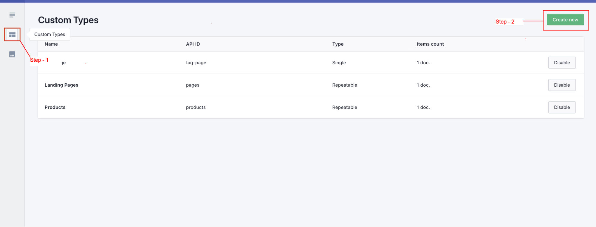
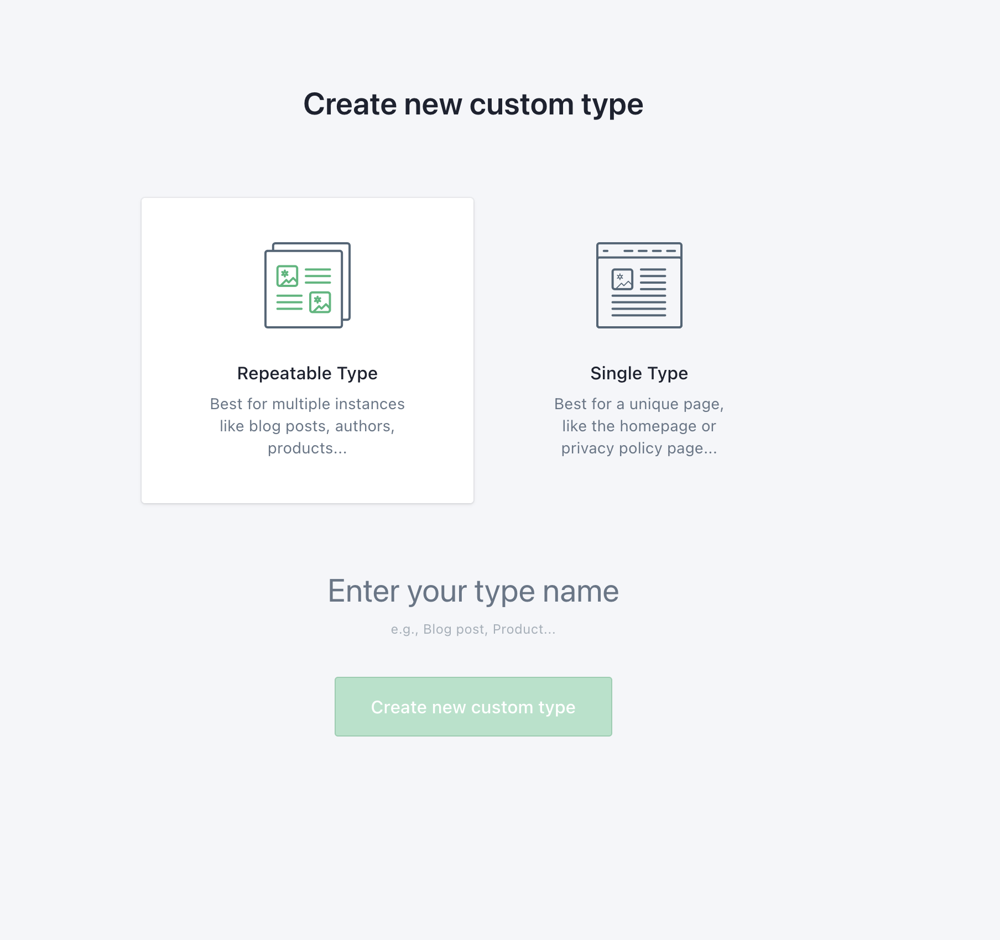
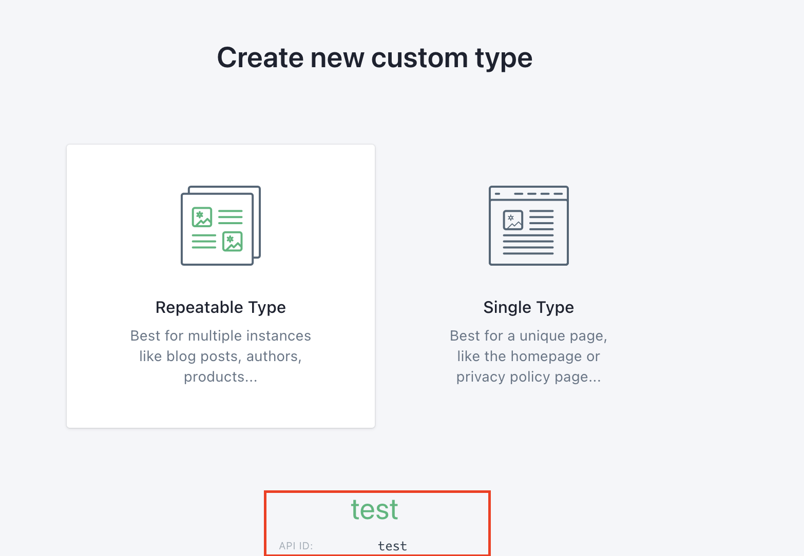

# Custom Types
On shopify, Each page should have a template based on which it'll be created. Custom types acts as an template.  
Custom types can be defined as a group of slices. Here we can create, modify, delete the slices belonging to that particular custom types.  

**Know more about slices**
<a class="green-link" href="./slices.html">here</a>

## Create a new custom types

* **Step 1**:  
**Go to custom types from the prismic dashboard.**

-----

* **Step 2**:  
**Select type of custom types**

::: tip Repeatable type:
Repeatable custom types can be used to create multiple documents from the same custom types. As I mentioned earlier, Each document(pages) should have a custom type, and if it's a repeatable one, we can reuse it to create multiple documents. 
Like, If our custom type's name is “Pages”, we can use it to create landing pages, About us pages. etc
:::

::: tip Single Type:

Single custom types can only be used once to create a single document, which can be useful for things like quiz page or faq page. 
:::

-----

* **Step 3**:  
**Enter the custom type name and click on create new custom type.**
:::warning
Custom type names shouldn’t be specific like homepage,  
Remember, these works as a template to create document(pages),  
However, generic names can be given to single-type custom types, as they will be only used once.
:::

## Customize Custom Types

* **Step 1**:  
**Click on the freshly created custom type.**

-----

* **Step 2**:  
**Required Placeholders**

Each Custom type requires the following attribute to work with shopify. 
Since prismic is not natively supported, we workaround with prismic by saving all the prismic data into metafields. 

:::danger Important
 There are few keys that need to be defined to make it work with our backend integration.Those keys are predefined and will be used for each and every custom type.
:::

To add the field and define the key, simply drag the required pre-defined elements and place it in the prismic build section.

-----

* **Step 3**:  
**Define Required Placeholders**

Following are the required fields that needs to be defined on each of the custom types. 

|      Element  Name    |        Field Name    |     API ID*            |                            
| --------------------- | ---------------------| --------------------- |
|           UID         |          Slug        | uid                   |
|           Title       |          Title       | page_title            |

:::tip Note
Prismic works by creating a new page, and saving all the data as a metafields of that created page.

In Shopify , to create a new page all we need is a page_handle(Slug)  and page title(Title) and that is what we are defining here. 

Please note that we are only defining the template(structure) here, we will be filling out these values while creating the document. 

:::

-----

* **Step 4**:  
**Save the changes**

If your custom types looks similar to this after the required fields been defined, We can start creating our first **slice**. 

