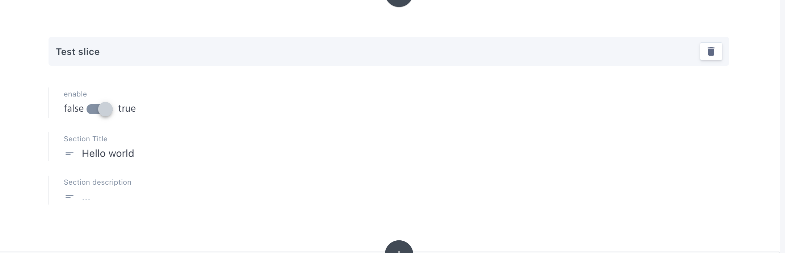

# Documents
Documents are the actual page that will be created in the shopify.  
Each document should have a custom type, which will define the components(slices) that we will be using for that specific page.  

:::warning Note 
Make sure you have created a custom type before creating a document.  
Learn more about  <a href="./custom-types" class="green-link">Custom Types</a>  
:::

## Create a new document

* **Step 1**:  
**Click on documents on prismic dashboard , and click on create new.**

----

* **Step 2**:  
**Select the custom type that you have created**

----

## Fill the required data  
Fill the required data that we defined on a custom type.
Refer to <a href="./custom-types" class="green-link">Custom Types</a> 

----

## Import slices

Import the slices that you want to use for the document(page) you are creating from the slices pool.

----

## Fill up slice data  
**Fill the data on the placeholder that we defined on slices.**  
Refer to  <a href="./slices" class="green-link">slices</a> 

::: danger Important !
Make sure that you added the required field, "enable" and its value is true. 
If the required field is missing or if its value is false.
Component won't render.
:::

----

## Save and Publish

Once you are done with all of the changes,
- Click on save
- Click on publish
- select publish it now

That's all from the prismic side.

Now lets move on to prismic adaptor to check our status.

----

