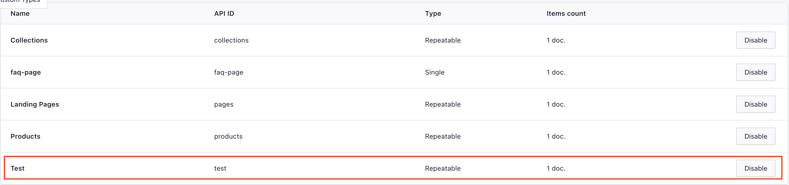
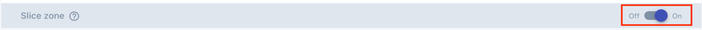
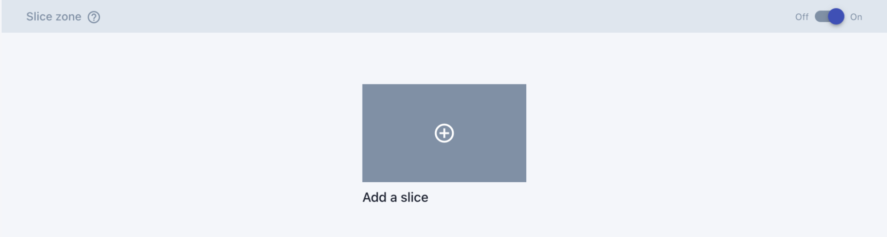
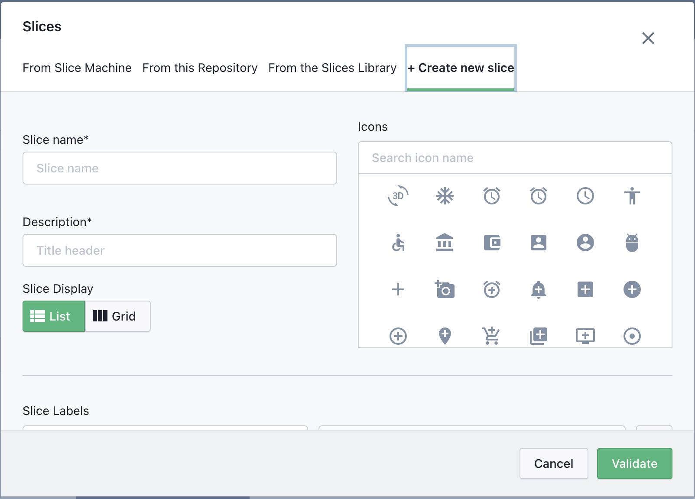
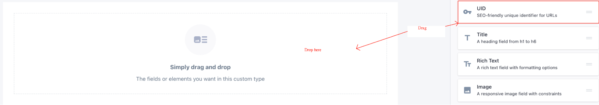
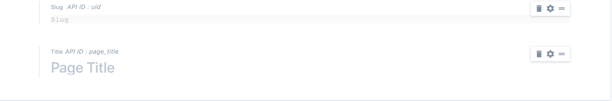

# Slices
Slices are the  reusable components that are built within the custom types using predefined elements(placeholders). 
Slices have scope within the parent custom type but it can be shared with other defined custom types.
and yes, each custom type will have its own instance of slice even if it is shared.

:::warning
Make sure that you have filled all the required fields on custom types, before you start working on slices.
<a href="./custom-types.html" class="green-link">
Refer to custom types
</a>
:::

## Create a new slice

* **Step 1**:  
**Go to custom types in prismic dashboard and select the custom types in which you want to add the slices**

-----

:::warning 
Make sure you have slice zone enabled

:::

----

* **Step 2**:  
**Click on add a slice**

----

* **Step 3**:  
**Select +create new slice**

----

* **Step 4**:  
**Fill in slice name and description and select appropriate icon**

:::warning
**Slice key** is generated through **slice name**, and once the key has been generated key **can’t be changed by changing the name**.So choose slice name wisely.  
**Slice key** is used as **metafields namespace** and for the **snippet name** in our codebase as well.  
**Slice key** is just a handelized text of the **slice name**.eg, “Hero Banner” would be “hero_banner”   
:::

----

* **Step 5**:  
**Click on validate**

----

:::tip
If it’s successfully created, then you should see something like this.

:::

## Customize Slices

* **Step 1**:  
**Click on the freshly created custom type.**

-----

* **Step 2**:  
**Required Placeholders**

Each Custom type requires the following attribute to work with shopify. 
Since prismic is not natively supported, we workaround with prismic by saving all the prismic data into metafields. 

:::danger Important
 There are few keys that need to be defined to make it work with our backend integration.Those keys are predefined and will be used for each and every custom type.
:::

To add the field and define the key, simply drag the required pre-defined elements and place it in the prismic build section.

-----

* **Step 3**:  
**Define Required Placeholders**

Following are the required fields that needs to be defined on each of the custom types. 

|      Element  Name    |        Field Name    |     API ID*            |                            
| --------------------- | ---------------------| --------------------- |
|           UID         |          Slug        | uid                   |
|           Title       |          Title       | page_title            |

:::tip Note
Prismic works by creating a new page, and saving all the data as a metafields of that created page.

In Shopify , to create a new page all we need is a page_handle(Slug)  and page title(Title) and that is what we are defining here. 

Please note that we are only defining the template(structure) here, we will be filling out these values while creating the document. 

:::

-----

* **Step 4**:  
**Save the changes**

If your custom types looks similar to this, after the required fields been defined. We can start creating our first **slice**. 

