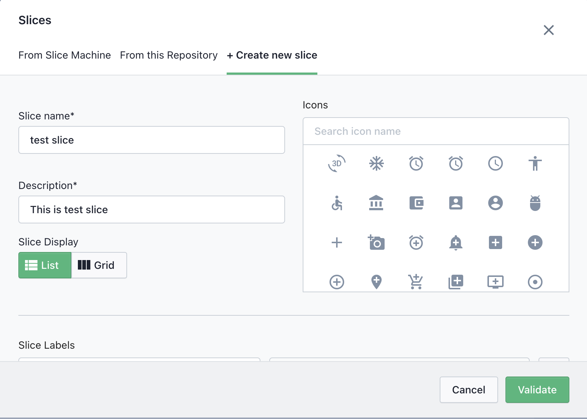
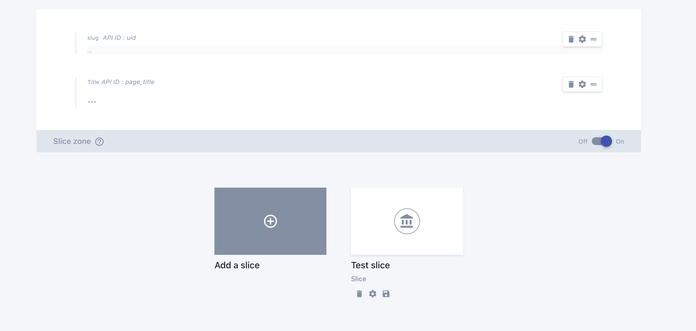
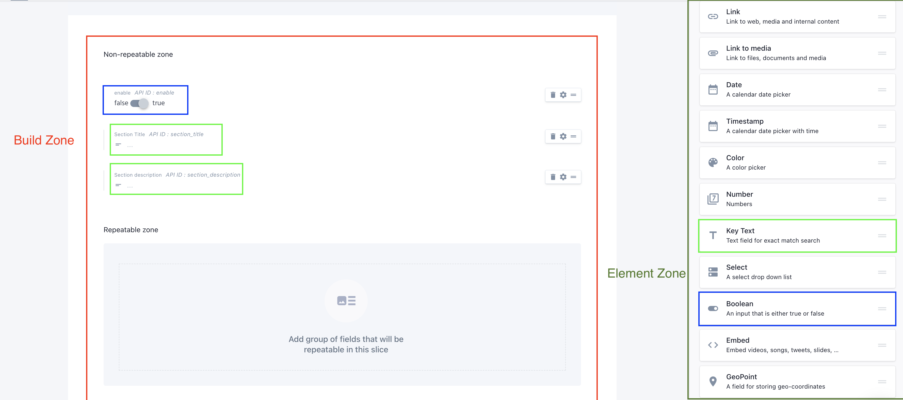

# Slices
Slices are the  reusable components that are built within the custom types using predefined elements(fieldss). 
Slices have scope within the parent custom type but it can be shared with other defined custom types.
and yes, each custom type will have its own instance of slice even if it is shared.

:::warning
Make sure that you have filled all the required fields on custom types, before you start working on slices.
<a href="./custom-types.html" class="green-link">
Refer to custom types
</a>
:::

## Create a new slice

* **Step 1**:  
**Go to custom types in prismic dashboard and select the custom types in which you want to add the slices**

-----

:::warning 
Make sure you have slice zone enabled

:::

----

* **Step 2**:  
**Click on add a slice**

----

* **Step 3**:  
**Select +create new slice**

**Fill in slice name and description and select appropriate icon**

:::warning
**Slice key** is generated through **slice name**, and once the key has been generated key **can’t be changed by changing the name**.So choose slice name wisely.  
**Slice key** is used as **metafields namespace** and for the **snippet name** in our codebase as well.  
**Slice key** is just a handelized text of the **slice name**.eg, “Hero Banner” would be “hero_banner”   
:::

----

* **Step 5**:  
**Click on validate**

----

:::tip
If it’s successfully created, then you should see something like this.

:::

## Slice Zones

*  **Understanding the different zones**  

Once you click on your newly created slice, you should see something like this.

## **Build Zone**
This is the place where you would define fields for your components.
There are two different types of zone: 

::: tip Non-repeatable zone:   
 Each element refer to the fields instead of the actual element,   
This zone refers to the elements that don’t repeat.  
If you are familiar with the shopify backend system,   
This zone works similar to the section settings.  
:::

::: tip Repeatable zone:  
This zone refers to the elements that might get repeated or need to repeat based on the requirement,
If you are familiar with the shopify backend system,
This zone works similar to block settings.
:::

-----

## **Element Zone**
This zone contains the list of pre-defined or supported fields.   
Each type of field defines the type of data it supports.  

## Add fields

To add the fields into the component(slices), simply **drag a element from the element zone** and drop it to the **required build zone**.   

:::warning 
There are few values you need to fill up , before it successfully adds to the required zone.  

 **Field name**:    
  It acts as a title for our elements/fields while filling out the actual data in the document. So make sure to name it something that would be self describing.

**API ID**:  
 This acts as an unique identifier for our element. API ID  is generated based on the field name, but you can change the API ID manually. 
:::

::: tip Note: 
If you have worked with shopify metafields before,
To fetch data from a metafield, We would require metafield **namespace** and **metafield key**
While **slice name** acts as a **namespace in metafields**, **API ID** works as a **metafield key** to fetch the specific data of the element. 
:::

-----

## Add required field  

Following are the required fields that needs to be defined on **Non Repeatable Zone** on each of the slices. 

|      Element  Name    |        Field Name    |     API ID*           |                            
| --------------------- | ---------------------| --------------------- |
|           Boolean     |          enable      |      enable           |

:::tip 
 We are checking value of this key to either show/hide the slices. So make sure, that its value is true if you want to render it in UI
:::

-----

Hit the save once you are done with adding up the fields based on the requirement.
And you have successfully created a slice.

Lets move on to documents.