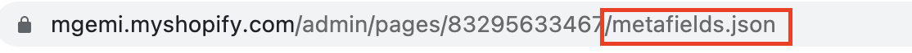
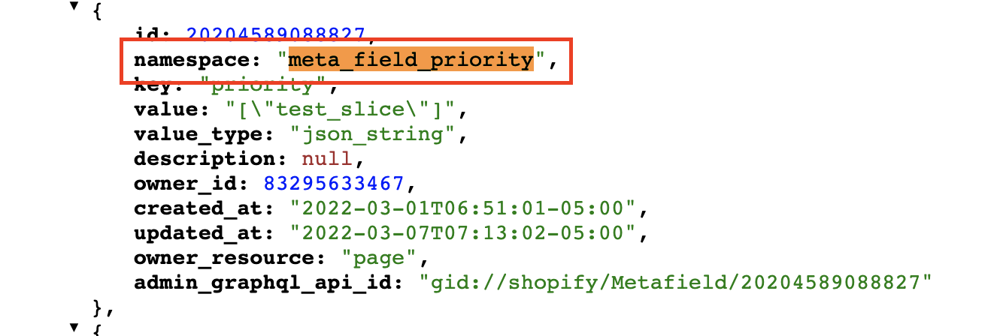

# Verify Integration

Once you have created your document and publish it. Work from our prismic side is done.  
But before moving to codebase implementation, its really important to verify if the integration was successful.

So we have one custom tool that will give us the status of the magic stuff that's happening on server side, **Prismic Adaptor**

Prismic adaptor provides us high-level information and the status of the ongoing job. i,e Either creating a new page with metafields or updating 
metafields on existing pages.
Also if there is any error, it'll give you a error message (most of the time there is nothing we can do).

Learn more about  <a class="green-link" href="/prismic-adaptor-integration/prismic-adapter">Prismic Adapter</a>

:::danger 
You should have adapter credential at this point if not, ping backend dev who worked on integration part. 
:::

## Login to Prismic Adapter

* Using the url provided for prismic adapter, login with the credential provided.
Contact the backend dev if those credential doesn't work out.  
Once you are logged in you should be able to see prismic adapter dashboard with multiple columns, the one we should really be worried about is 
**Sync Status**.

----

## Check status 

While you are logged in to prismic adapter,  
Remember the page title you added while creating the document ?  
Refer to <a href="./documents" class="green-link">Documents</a>   

find the row with the same title from **resource title** column in prismic adapter.

Check the status from , **sync status** column in prismic adapter.

**Make sure its status is not error**. More about errors <a href="./common-adapter-errors.html" class="green-link">here</a>

::: warning
Make sure that you refresh page in every 30s.
:::

**Once your sync status is completed. Lets check on shopify.**

----

## Check for page metafields on shopify

- **Go to page url**

 

 

----
 
- **Add "/metafields.json" at the end of url**

 

  

  ----

- **Search for 'meta_field_priority'**

 

----

:::danger
If 'meta_field_priority' doesn't exist , which means our integration has failed. Check if there is any error on prismic adapter dashboard.
Check here: <a href="#check-status" class="green-link">Check prismic publish status</a> 
:::

**After everything is verified, Now we can dive into <a href="./code-integration.html" class="green-link">code integration.</a>**

