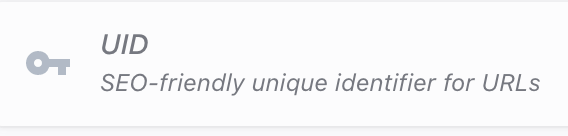
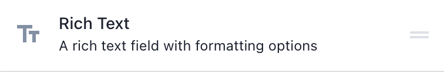
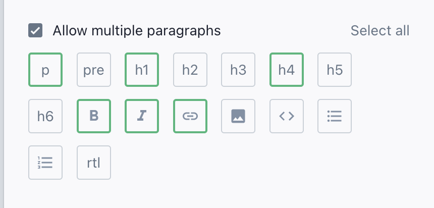
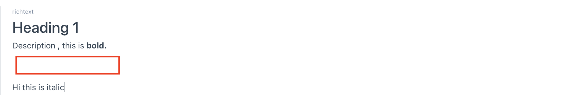
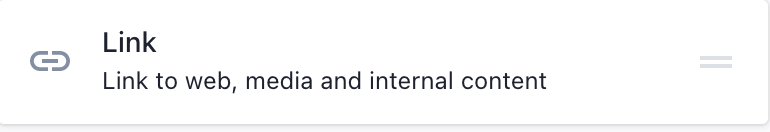
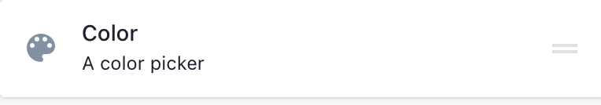
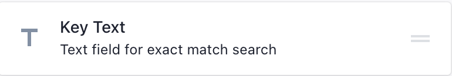
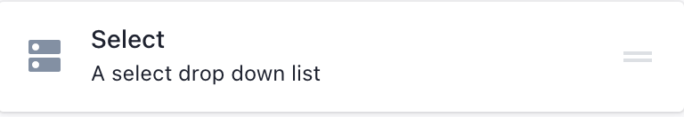
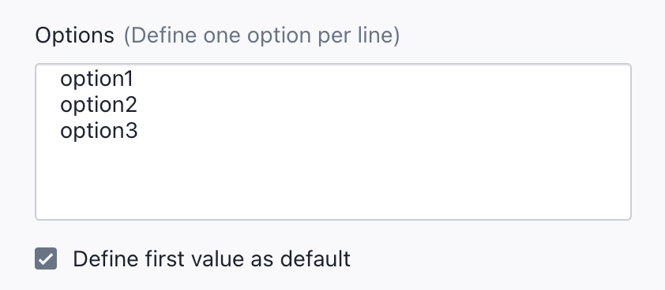
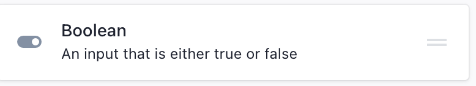

# Common Built In Elements

## UID
<div class="block-space"></div>

<div class="block-space"></div>
This element can only be used once.
We use this element to create slug. 
More about slug in <a href="./custom-types.html#create-a-new-custom-types" class="green-link">Custom Type </a>

<div class="block-space"></div>

----

## Richtext
<div class="block-space"></div>

<div class="block-space"></div>
Handling rich text might get little tricky esp. when you want to fetch data with the richtext styles intact.

You can use this snippet to fetch the richtext along with the supported styles.

Add the richtext with following options.




<SourceCode>
<<< @/src/source-files/richtext.liquid
</SourceCode>


Oh, wait. 

**In order to add horizontal break space based on richtext editor format. You need to write few lines of css**



just add these css properties

```

.richtext__text {
    line-height: 20px;
    display: inline-block;
}
```


**Supported Feature:**

- Bold
- Italic 
- Link
- normal(paragraph)
- heading1
- heading 4

<div class="block-space"></div>

----

## Image
<div class="block-space"></div>

<div class="block-space"></div>
Implement image with lazyload snippet.  
<a href = "./code-snippets.html#lazyloading-images" class="green-link">Lazyload Images</a>

<div class="block-space"></div>

----


## Link
<div class="block-space"></div>

<div class="block-space"></div>
Link is used to store the url. It supports both prismic document or any valid website url.

Use this snippet to fetch url. 

```
section['placeholder_id'].url
```

<div class="block-space"></div>

----

## Color
<div class="block-space"></div>

<div class="block-space"></div>
Color is used to store color values

Use this snippet to fetch color.
```
section['placeholder_id']
```

<div class="block-space"></div>

----

## Number
<div class="block-space"></div>

<div class="block-space"></div>
Number is used to store numeric values.  
It Supports fractional number as well.

Use this snippet to fetch number value.
```
section['placeholder_id']
```

<div class="block-space"></div>

----

## Key Text
<div class="block-space"></div>

<div class="block-space"></div>
key text is used to store alphabet values.  

Use this snippet to fetch key text value.
```
section['placeholder_id']
```

<div class="block-space"></div>

----

## Select
<div class="block-space"></div>

<div class="block-space"></div>
key text is used to store selected value from provided option.  
option are shown in documents while filling up the data.

First add up the options in select.



Use this snippet to fetch selected value.

```
section['placeholder_id']
```

<div class="block-space"></div>

----

## Boolean
<div class="block-space"></div>

<div class="block-space"></div>
Boolean is can store either true or false value.
You can toggle this value while filling up the data.

Use this snippet to fetch selected value.

```
section['placeholder_id']
```

<div class="block-space"></div>

